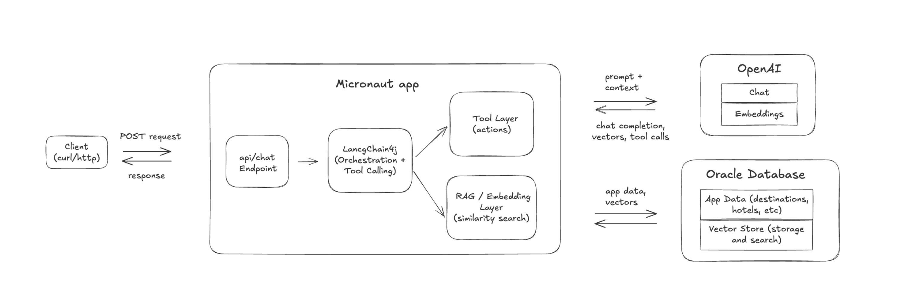

# Swiss Travel Advisor

An AI-powered travel assistant for discovering Swiss destinations, hotels, and activities. Ask questions in plain language — "recommend a cozy ski town" or "add Zermatt to my wishlist" — and the assistant understands your intent, not just your keywords.

Built with Micronaut 5, LangChain4j, Oracle AI Database, and GraalVM Native Image.




## How It Works

When a user asks a question, the app embeds the query using OpenAI's `text-embedding-3-small` model, then runs a vector similarity search in Oracle Database to find destinations that *mean* the right thing — even if they don't contain the exact words. The LLM decides which tools to call (search, wishlist, etc.), and LangChain4j handles execution and message routing.

On startup, Flyway runs database migrations and loads destinations, hotels, and activities. The `DataInitializer` then generates and persists vector embeddings for all entries, enabling semantic search from the first request.

## Architecture

- `SwissTravelAssistant` — LangChain4j `@AiService` handling conversation and tool orchestration
- `TravelTools` — `@Tool` methods for semantic search (destinations, hotels, activities) and wishlist management
- Repositories — JDBC-based with Oracle `VECTOR_DISTANCE(..., COSINE)` queries
- `EmbeddingService` — generates embeddings via OpenAI
- `DataInitializer` — populates embeddings on startup

## Quick Start

### 1. Configure Oracle Database

By default, this project uses [Oracle Autonomous Database](https://www.oracle.com/autonomous-database/) via TLS connection.
It now shares the same environment variable names as
`/home/opc/demo-central/devoxx-greece/pet-vector-search`.

Required environment variables:

```bash
export ORACLE_JDBC_URL='<oracle-jdbc-url>'
export DB_PASSWORD=
```

Optional environment variable:

```bash
export DB_USERNAME=ADMIN
```

If you already use Micronaut-native datasource variables, these still override the
shared names:

```bash
export DATASOURCES_DEFAULT_URL=
export DATASOURCES_DEFAULT_USERNAME=
export DATASOURCES_DEFAULT_PASSWORD=
```

### 2. Set Your OpenAI API Key

```bash
export OPENAI_API_KEY=your-key
```

### 3. Run the Application

```bash
./mvnw mn:run
```

Flyway runs the migration scripts on startup, creating tables and inserting the
destinations, hotels, and activities. Once the server is running, the
`DataInitializer` generates vector embeddings, enabling semantic search.

Micronaut Test Resources is now disabled by default. If you explicitly want that
old local/dev path, start with:

```bash
./mvnw -Dmicronaut.test.resources.enabled=true mn:run
```

## Building a Native Image

```bash
./mvnw package -Dpackaging=native-image
./target/swiss-travel-advisor
```

The app starts at `http://localhost:8080`.

The the native executable:
- Has the size of 132 MB
- Starts and connects to the database in 122 ms
- Even under load, consumes only around 98 MB RAM.


## Example Queries

```bash
http POST http://localhost:8080/api/chat message="recommend best ski resorts"


http POST http://localhost:8080/api/chat message="add Interlaken to my wishlist"
http POST http://localhost:8080/api/chat message="retrieve my wishlist"
```

Or with curl:

```bash
curl -X POST http://localhost:8080/api/chat \
  -H "Content-Type: application/json" \
  -d '{"message": "I want to visit a peaceful mountain resort"}'
```
