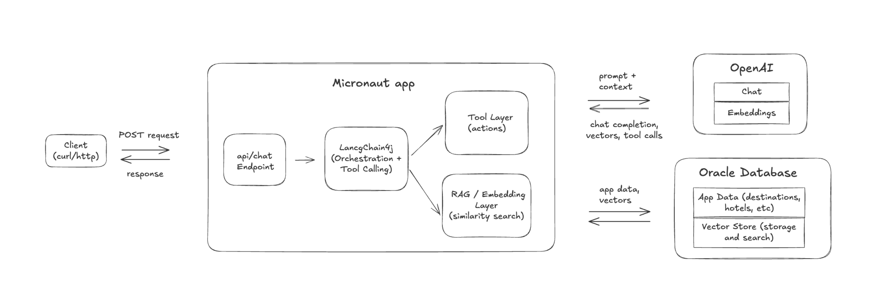

# Swiss Travel Advisor

An AI-powered travel assistant for discovering Swiss destinations, hotels, and
activities. Ask questions in plain language—"recommend a cozy ski town" or
"add Zermatt to my wishlist"—and the assistant understands your intent, not
just your keywords.

Built with Micronaut 5, LangChain4j, Oracle AI Database, and GraalVM Native
Image.



## How It Works

When a user asks a question, the app embeds the query using OpenAI's
`text-embedding-3-small` model, then uses Micronaut Data repositories to run
Oracle AI Database vector similarity search. For location-aware requests, it
combines that with Oracle Spatial radius filters over seeded Swiss destination
coordinates. The LLM decides which tools to call (search, nearby search,
wishlist, etc.), and LangChain4j handles execution and message routing. A
bounded chat history is stored in Oracle by conversation ID so follow-up
requests retain their context across application restarts.

Nearby search resolves location names from the seeded destination catalog, not
an external geocoder. The current anchors are Zermatt, Interlaken, Lucerne,
Lausanne, St. Moritz, Lugano, and Zurich.

On startup, Flyway runs database migrations and loads destinations, hotels, and
activities. The `DataInitializer` then generates and persists vector embeddings
for all entries, enabling semantic search from the first request.

## Demo Flow

### 1. Configure the services

The default setup uses
[Oracle Autonomous Database](https://www.oracle.com/autonomous-database/) via a
TLS connection:

```bash
export OPENAI_API_KEY='<openai-api-key>'
export ORACLE_JDBC_URL='<oracle-jdbc-url>'
export DB_PASSWORD='<database-password>'
```

`DB_USERNAME` defaults to `ADMIN`. Micronaut's
`DATASOURCES_DEFAULT_URL`, `DATASOURCES_DEFAULT_USERNAME`, and
`DATASOURCES_DEFAULT_PASSWORD` variables can be used instead and take
precedence.

Start Phoenix separately so it remains available if the database is switched:

```bash
podman machine start
podman-compose up -d phoenix
```

### 2. Build and run

Build the Native Image executable once:

```bash
./mvnw clean package -Dpackaging=native-image -DskipTests
```

Run it against ADB:

```bash
./target/swiss-travel-advisor
```

Open [http://localhost:8080](http://localhost:8080) for the chat interface. The
JSON API is available under `/api`.

The same executable works with both ADB and local Oracle. The database URL,
credentials, OpenAI key, and model are runtime configuration; a separate local
build is not required.

### 3. Try the demo

With HTTPie:

```bash
http POST http://localhost:8080/api/chat message="recommend best ski resorts"
http POST http://localhost:8080/api/chat message="find quiet lakeside hotels near Lucerne under 250 CHF"
http POST http://localhost:8080/api/chat message="show scenic activities within 40 km of Interlaken"
http POST http://localhost:8080/api/chat message="show best activities in Zurich"
```

Or with curl:

```bash
curl -X POST http://localhost:8080/api/chat \
  -H "Content-Type: application/json" \
  -d '{"message": "I want to visit a peaceful mountain resort"}'
```

The JSON response contains both `conversationId` and `message`. Pass the same ID
on a follow-up request:

```bash
curl -X POST http://localhost:8080/api/chat \
  -H "Content-Type: application/json" \
  -d '{
    "conversationId": "<conversation-id-from-the-first-response>",
    "message": "Which of those is the most affordable?"
  }'
```

Omit `conversationId` to start a new conversation. Conversation IDs are UUIDs,
and the most recent 20 messages in each conversation are retained. Use the same
conversation ID when adding or retrieving items from that conversation's
wishlist.

### 4. Showcase hybrid ranking and its score

Use a request that combines meaning with a hard location constraint:

```text
Find a quiet lakeside destination within 50 km of Lucerne.
```

For nearby destination searches, `DestinationRepository` runs one explicit
Micronaut Data `@Query` that applies Oracle Spatial's radius predicate and then
orders the remaining rows with Oracle vector cosine distance. It returns a
`DestinationSearchResult` projection rather than the complete database entity.
The projection includes the raw cosine distance, and the tool output labels it
clearly: **lower is closer**. It is a ranking signal, not a confidence percentage
or a guarantee that the recommendation is correct.

For a reliable on-stage view, open the corresponding `TOOL` span in Phoenix.
Its output shows each destination and cosine distance even if the assistant
chooses not to repeat the numeric value in its prose.

### 5. Verify the build and real Oracle query

Run the fast unit tests first; these do not require Oracle or an OpenAI key:

```bash
./mvnw test
```

The hybrid query has a separate opt-in integration test because an in-memory
database cannot verify Oracle's vector and spatial functions. To run it against
local Oracle Database Free:

```bash
podman machine start
podman-compose up -d oracle

# Wait until this prints "healthy".
podman inspect --format '{{.State.Health.Status}}' swiss-travel-oracle

export ORACLE_INTEGRATION_TEST=true
export ORACLE_JDBC_URL='jdbc:oracle:thin:@//localhost:1521/FREEPDB1'
export DB_USERNAME='TRAVEL'
export DB_PASSWORD="${LOCAL_ORACLE_PASSWORD:-LocalDemoPassword1}"

./mvnw clean test -Dtest=OracleHybridSearchIT
```

The test inserts two temporary 1,536-dimensional vectors, proves that the
spatial predicate includes them, verifies that cosine distance orders the exact
match first, checks projection mapping, and removes the temporary rows. To run
against ADB instead, keep the same test command and supply the ADB JDBC URL and
credentials already used by the application.

### 6. Use local Oracle if ADB is unavailable

Stop the application with `Ctrl-C`, then run:

```bash
./scripts/run-with-local-oracle.sh
```

The script starts only Oracle Database Free using
`gvenzl/oracle-free:23-faststart`, waits until it is healthy, configures the
local `TRAVEL` user, and launches the same Native Image executable. Phoenix is
left running. The local connection does not require a wallet.

Flyway creates and seeds the same schema used with ADB. The `oracle-data` volume
retains the database and generated embeddings between runs. The local-only demo
password can be overridden with `LOCAL_ORACLE_PASSWORD`.

### 7. Shut down after the demo

Stop the application with `Ctrl-C`, then stop the remaining demo containers:

```bash
./scripts/stop-demo-containers.sh
```

The script preserves the containers, downloaded images, Phoenix traces, and
local database data for the next run.

## Observability with Phoenix

Tracing is enabled by default for the demo. Open
[http://localhost:6006](http://localhost:6006) and select the
`swiss-travel-advisor` project after sending a chat request.

A chat turn appears as an `AGENT` span with nested `LLM`, `TOOL`, `EMBEDDING`,
and `RETRIEVER` spans. This makes it possible to inspect model latency, tool
selection, vector and spatial retrieval, prompts, responses, token usage, and
errors in one trace. Conversation IDs are propagated as `session.id`, so
multi-turn conversations also appear in the Sessions tab.

Generate a curated set of traces with:

```bash
./scripts/generate-demo-traces.sh
```

Use `DEMO_ROUNDS=3` for a denser metrics dashboard. The script requires `curl`
and `jq`.

Prompt and response content is captured by default to make the demo useful for
debugging. Disable content capture while retaining operational telemetry with:

```bash
AI_TRACING_INCLUDE_CONTENT=false ./target/swiss-travel-advisor
```

## Main Components

- `SwissTravelAssistant` — LangChain4j `@AiService` for conversation and tool
  orchestration
- `TravelTools` — semantic search, nearby search, and wishlist `@Tool` methods
- Micronaut Data repositories — Oracle vector `Near` queries and Oracle Spatial
  radius queries
- `EmbeddingService` and `DataInitializer` — embedding generation and backfill
- `OracleChatMemoryStore` — bounded conversation history stored as JSON in
  Oracle

For development, the application can also be run on the JVM with:

```bash
./mvnw mn:run
```
